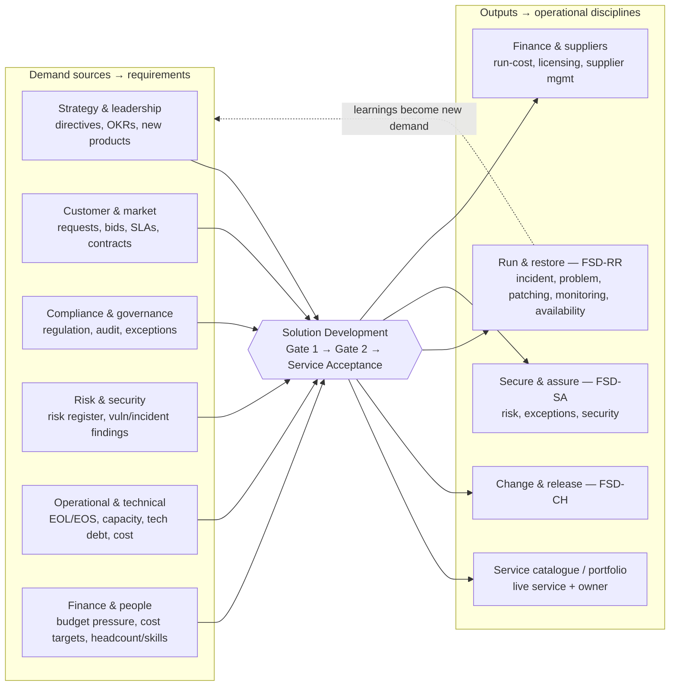

# FitSD — Adoption & Positioning

> **What this is.** The *who, why and how-far* of FitSD — who picks it up, what pulls them in, and how it fits teams of different sizes. None of it is normative; it adds no requirements. The framework stays lean. This is the story around it.

## 1. The case, in a line

FitSD gives a technical team just enough governance to take on the right work and ship it so it can be run — and, just as usefully, a shared language for getting a yes out of the people who hold the budget.

## 2. Why a team actually adopts it

Most lightweight-ITSM material sells control. FitSD's real pull is the opposite: it helps technical people get heard.

Look at what it produces. The Idea Brief and the Gate 1 Outline Proposal are a project proposal in the language leadership already speaks — the driver, the cost of doing nothing, the options, the effort, and a clear decision to make. That turns "we need to replace the ageing build pipeline" from a nervous meeting and a blank page into a one-pager with a yes/no at the bottom. For an engineer who has watched good ideas die for want of a way to pitch them, that's the hook.

The rest follows from there:

- **Readiness is built in.** The acceptance criteria stop you shipping things that run but can't be supported, recovered or secured — the exact failure mode that becomes a 2 a.m. page or an audit finding.
- **Credibility without a PMO.** It leaves the evidence trail customers and auditors ask for — acceptance records, a risk register, change records — without an enterprise governance team to produce it.
- **An on-ramp, not a dead end.** It maps cleanly onto ISO 27001 and NIS2 (see *Standards Alignment*), so the discipline you build early isn't wasted if you grow into the heavier standards.

## 3. The use case worth leading with

Talking upward is where FitSD earns its keep.

**Engineer to manager.** Fill the Idea Brief to frame the need, then Gate 1 to make the case. You walk in with a proposal, not a problem; your manager gets something they can compare against the last three, instead of another corridor pitch.

**Team lead to the board.** Stack the Gate records up and you have a portfolio view: here's our demand, here's what we propose, here's what we need to proceed. The gates *are* the governance conversation — leadership steers by approving, parking or rejecting at Gate 1, and funds the build at Gate 2. It puts the team's work in the language of risk and investment the board already uses.

Either direction, the trick is the same: the form does the framing. The hard part of talking to leadership — structure, brevity, a clear ask — is baked into the template, so you don't have to be good at it on the day.

## 4. Where Solution Development sits

Demand feeds in from across the business; the outputs feed the operational disciplines. Compliance is one lane of several — not the whole story — and what you learn running a service (a nasty incident, a capacity ceiling) loops back round as fresh demand.

Six families of demand come through that door: strategy and leadership; customer and market; compliance and governance; risk and security; operational and technical; finance and people. It has to read plainly to all of them — which is why Gate 1 stays in business language, not security jargon.

## 5. Fit by organisation size

| Size | What FitSD is to them | Why they'd adopt it |
|---|---|---|
| **Solo / very small (1–5)** | Mostly self-discipline — the front door plus a service register | It stops you shipping things you, alone, can't support later |
| **Small team in a bigger org** | A defensible intake that plugs into the parent's existing change, incident and governance | It gets the team heard and funded, without inheriting the parent's weight |
| **SMB (10–200)** | The whole lightweight management system, and the on-ramp to ISO 27001 / NIS2 | Credibility to customers and regulators, with no enterprise PMO |
| **Enterprise** | A team-level front door feeding the heavier ITIL machinery | Local discipline; it was never meant to be the system of record |

## 6. Where FitSD is the wrong tool

- **Not a full ISMS or ITIL** when certification scope, scale or a contract actually demands the heavy apparatus — a formal risk methodology, a Statement of Applicability, internal audit. FitSD is the on-ramp, not the destination.
- **Not for routine change.** Day-to-day BAU belongs in Change & Release (FSD-CH), not the gates. The scope test in `FSD-PRO §1` exists precisely to keep it out.
- **Little to add** for a team already running mature ITIL or ISO that works — beyond, maybe, borrowing the intake-first pattern as a front door.

## 7. The adoption journey

Nobody adopts a framework by reading it end to end. They take one step, get a win, and come back for the next. FitSM understood this — its real engine isn't the standard, it's the ladder of certifications that always gives people a next rung. FitSD has no certification body, but it can offer the same shape: a visible next step at every stage.

1. **Discover — "is this even for me?"** Two minutes with the README should settle it. If you're a small team stuck between "just ship it" and "we really should have a process," you're the audience.
2. **Try — one project, this week.** Don't adopt the framework. Take one real piece of work and run it through the front door: a one-page Idea Brief, a Gate 1, and the Definition of Done at the end. One real piece of work — with a genuine trigger and trade-offs that could go either way — tells you more than any amount of reading. One project is enough to feel whether it helps.
3. **Adopt — make it the default.** Copy the four forms and **ratify your SAC baseline** — your own thresholds, set once and inherited by every solution. Agree the requirements you'll actually hold to, and point Change, Incident and Security at the processes you already run. *FitSD — Implementation Guide* walks the whole standup. Now everything new comes through the same door.
4. **Mature — find your level.** The self-check (0–5 per capability) tells you where you stand and what one notch better looks like. It's the no-bureaucracy answer to FitSM's Foundation / Advanced / Expert ladder: a compass, not a certificate.
5. **Share — close the loop.** Send back a worked example, a capability you've fleshed out, or a fix. The framework gets better one contribution at a time, from everyone who passes through.

The most persuasive thing FitSD can have is a **worked example**: a real project, messy, with a genuine trigger and decisions that could have gone either way. One of those brings people on board far better than any amount of explanation — which is why a public one sits high on the roadmap. Lead with the story, not the spec.

---

*Companion documents: `FitSD — Framework Charter` (what it is), `FitSD — Requirements` (the spine), `FitSD — Standards Alignment` (how it maps to ISO 27001 / NIS2 / ITIL / FitSM), `FitSD — Diagrams` (the visuals).*
