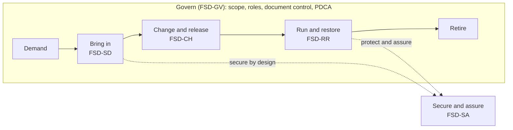
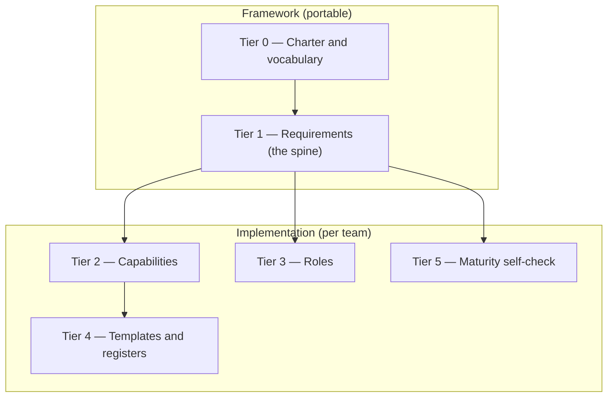

# FitSD — Framework Charter

*Fit for Solution Development. Just enough process to take on the right work and ship it so it lasts.*

> **v0.1 — the founding layer.** This is Tier 0: what FitSD is, and the model everything else hangs off. The testable requirements live next door in *FitSD — Requirements* (Tier 1). The lower tiers — capabilities, roles, templates, the maturity check — come after.

## 1. What FitSD is

A small team trying to run services properly hits the same wall every time. ITIL and ISO 20000 assume a department, a budget, and people whose whole job is process. Most teams have none of that. They still have to decide what's worth building, design it so it can actually be run, and not get caught out when it breaks at the worst moment.

FitSD is the smallest amount of that discipline a handful of people can keep up. It takes what ITIL, ISO 20000 and FitSM get right and drops everything a small team can't sustain.

The name nods to **FitSM** (*Fit for Service Management*), the lightweight ITSM standard it sits closest to. FitSD is *Fit for Solution Development* — same intent, narrower focus: the front door work comes through. *(Working name; the naming story is in the project's notes.)*

## 2. Where it sits

FitSD doesn't compete with ITIL or ISO 20000. It's a smaller cut of the same cloth, for teams where the full thing would be overkill.

| Framework     | Weight                              | FitSD's relationship                                                     |
| ------------- | ----------------------------------- | --------------------------------------------------------------------------- |
| ITIL 4        | Heavy, whole value chain            | FitSD borrows the lifecycle ideas, drops the breadth                     |
| ISO/IEC 20000 | Certifiable standard                | FitSD requirements are a defensible subset                               |
| FitSM         | Lightweight, ~14 processes, neutral | Closest cousin; FitSD is lighter still and **intake-first**              |
| USM / VeriSM  | Method / digital-first              | Compatible philosophies; FitSD is more prescriptive about the front door |

Two commitments set it apart. Work enters through one front door, not a dozen side channels. And nothing goes live until it's ready to be run — documented, recoverable, secure, monitored, supportable — not just switched on. Security and resilience are designed in from the start, not bolted on once an auditor asks.

## 3. Principles

The rules that decide what makes the cut.

1. **Minimum viable governance.** The least structure that still controls the risk. If a rule doesn't change a decision, it's out.
2. **Every artefact earns its place.** No document, register or form exists unless something depends on it.
3. **One person, many hats.** Roles are jobs to be done, not headcount — but every service has exactly one accountable owner.
4. **Intake first.** Get control of what comes *in* before polishing anything downstream.
5. **Readiness is the finish line.** "Done" means documented, recoverable, secure, monitored and supportable. Not merely running.
6. **Secure by design.** Legal and regulatory duties (NIS2 and the like) are built in, with the evidence kept.
7. **Work first, certify later.** Get it running at small scale; formal alignment can follow.

## 4. The capability model

FitSD splits service management into five groups. A small team rarely needs a sixth.

| Group                | Question it answers                     | Core capabilities                                                    |
| -------------------- | --------------------------------------- | -------------------------------------------------------------------- |
| **Govern**           | Are we running a managed system at all? | Scope, document control, roles, continual improvement (PDCA)         |
| **Bring in**         | How does new work enter?                | **Solution Development** — intake, design, service acceptance        |
| **Change & release** | How do we change live services safely?  | Change management, release & deployment                              |
| **Run & restore**    | How do we keep services healthy?        | Incident & major incident, problem, availability & monitoring, patch |
| **Secure & assure**  | How do we stay safe and compliant?      | Risk, access, backup & recovery, exceptions, regulatory alignment    |

**Bring in is the one that matters most.** Solution Development gets built first because it reaches into all the others — its acceptance criteria drag in security, backup, availability, access, monitoring and change whether you planned for them or not. Get the front door right and the rest of the house reveals itself.

## 5. The six-tier document model

Six tiers. The top two are the framework; the rest are how a given team puts it into practice.

| Tier | Name                      | Purpose                                                          | Status                                          |
| ---- | ------------------------- | ---------------------------------------------------------------- | ----------------------------------------------- |
| 0    | **Charter & vocabulary**  | What FitSD is, its principles and model (this document)       | v0.1                                            |
| 1    | **Requirements**          | Testable "shall" statements per capability — the auditable spine | v0.1                                            |
| 2    | **Capabilities**          | Process descriptions: objective + key activities                 | SD full process; cards for GV/CH/RR/SA         |
| 3    | **Roles**                 | The role model (see §6)                                          | later                                           |
| 4    | **Templates & registers** | Forms, registers, records used to run the capabilities           | Solution Development built (FSD-FRM-01/02/03) |
| 5    | **Maturity self-check**   | A 0–5 capability self-assessment (see §7)                        | later                                           |

## 6. Roles

FitSD names functions, not job titles. On a small team one person wears several of these at once.

| Role                        | Responsibility                                                           |
| --------------------------- | ------------------------------------------------------------------------ |
| **Management System Owner** | Owns FitSD adoption, the document set, and the review cycle           |
| **Service Owner**           | Accountable, end-to-end, for a given service                             |
| **Approver**                | Authorises gates, changes and acceptances at a level appropriate to risk |
| **Operator**                | Performs the work; maintains records                                     |
| **Consulted SME**           | Provides specialist input (e.g. security, architecture)                  |

## 7. Conformance and maturity

You conform to FitSD when you can show each Tier 1 requirement is met — with your own documents, tools and registers. It's about meeting the requirement, not adopting our templates.

Maturity is a rough self-assessment, scored per capability:

| Level | Meaning                                            |
| ----- | -------------------------------------------------- |
| 0     | None — not done                                    |
| 1     | Ad hoc — done, but inconsistently and undocumented |
| 2     | Defined — documented and repeatable                |
| 3     | Operating — followed in practice across the team   |
| 4     | Measured — metrics watched and acted on            |
| 5     | Improving — routinely refined through PDCA         |

Nobody's expected to hit 5 across the board. "Good enough for now" is a real answer — as long as it's a call you made on purpose and wrote down.

## 8. Vocabulary

Only the words that carry a specific meaning here.

**Service.** Something the team provides to a customer, internal or external, that is run and supported — not just built once and forgotten.

**Capability.** A coherent area of service-management practice (see §4).

**Requirement.** A testable "shall" statement that must be met to conform (Tier 1).

**Gate.** A decision point with explicit go / hold / stop outcomes.

**Service Acceptance / Definition of Done.** The conditions a service must meet, with evidence, before it goes live.

**Implementation profile.** A team's local version of FitSD — their actual documents, mapped to the requirements.

## 9. Ownership and licensing

FitSD is a personal project, owned privately by Tristan Findley. It carries no organisation's fingerprints, so any team can pick it up and map it to their own setup.

FitSD is released under **Creative Commons Attribution 4.0** (CC BY 4.0) — free to use, adapt and build on, including commercially, as long as the origin is credited (see `LICENSE`). Attribution over no-derivatives is a deliberate choice: making your own implementation profile *is* the point, so derivatives have to be allowed.

---

*Next door: the Tier 1 requirements. The lower tiers follow once the spine settles.*
