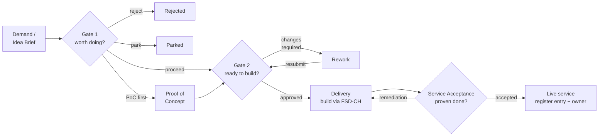

# FSD-PRO — Solution Development Process

*FitSD reference capability — Solution Development. Satisfies FSD-SD-1…6.*

## §1 Purpose and Scope

This process controls how net-new work enters the team's stream and follows it through to the point it is accepted into live service. The point is plain: don't commit real effort until an idea has earned it, and don't call something done until it can actually be run — documented, recoverable, secure, access-controlled and monitored, not just switched on.

It uses **two decision gates** at the front and a **Service Acceptance** close-out at the end:

- **Gate 1 — Outline Proposal:** is this worth doing?
- **Gate 2 — Solution Design:** is it ready to build?
- **Service Acceptance:** has it been proven done?

**In scope.** A piece of work enters Solution Development if it meets **any** of the following:

- It introduces a **new service, product, or platform capability** not currently offered; or
- It requires **new infrastructure or a new architecture**, beyond a configuration change to something that already exists; or
- Its estimated effort exceeds **approximately 10 person-days**; or
- It creates a **material new ongoing operating burden or cost** — a new support or operational responsibility, new licensing, or a new run-cost.

**Out of scope.** Routine changes and minor enhancements are handled under the **Change & Release** capability (FSD-CH). Incidents, problems and patching are handled under **Run & Restore** (FSD-RR). Work that begins here always hands the actual build and deployment back to Change & Release — this process governs the *decision to take on and design* the work, not the individual changes that deliver it.

---

## §2 Definitions

**Gate.** A defined decision point at which the Approver authorises the work to proceed, with or without conditions. Work does not advance past a gate until it is signed off.

**Solution Owner.** The person accountable for the proposed solution. They complete the gate and acceptance records and drive the work through each gate.

**Approver.** The role that reviews and signs off Gate 1, Gate 2, and Service Acceptance, at a level appropriate to the risk.

**Contributor.** A subject-matter expert or engineer who provides input — effort estimates, architecture, operational impact — and is named on the relevant record.

**Proof of Concept (PoC).** A time-boxed, low-cost experiment to resolve genuine feasibility uncertainty. Identified at Gate 1 and, where required, completed before Gate 2 is submitted.

**Service Acceptance Criteria (SAC).** The standard Definition of Done for any solution delivered through this process — the operational outputs in §7 (the Definition of Done) that must exist alongside the product itself.

**Net-new.** Work meeting any of the in-scope triggers in §1; the test that distinguishes Solution Development work from a routine change.

---

## §3 Roles

| Role               | Responsibility                                                                                             |
| ------------------ | ---------------------------------------------------------------------------------------------------------- |
| **Solution Owner** | Accountable for the solution; completes the gate and acceptance records; drives the work through each gate |
| **Approver**       | Reviews and signs off Gate 1, Gate 2, and Service Acceptance; records any conditions                       |
| **Contributors**   | Provide effort estimates, architecture, and operational input; named on the records                        |

A single person may hold more than one role, but accountability for any one solution rests with a single Solution Owner, and each gate has a single accountable Approver.

---

## §4 Lifecycle

The lifecycle runs Idea → Gate 1 → optional PoC → Gate 2 → Delivery → Service Acceptance → In service. Each gate has explicit outcomes (§5–§7). Once Gate 2 is approved, delivery is run as a project and the build and deployment changes are raised and controlled through Change & Release (FSD-CH). The solution is only accepted into service once the Service Acceptance Criteria are evidenced.

**System of record.** Live gate records, the delivery project, and the Service Acceptance checklist are held in the team's project / work-tracking system. The framework holds this process and the blank form templates only (FSD-FRM-01/02/03).

---

## §5 Gate 1 — Outline Proposal

**Purpose.** Decide whether the idea is worth pursuing before any design effort is spent.

**What is captured** (on FSD-FRM-01): the idea and the customer or business need; the benefits; the **primary driver** (value, compliance, or risk reduction); a light value score across four plain lenses (growth, retention, efficiency, and risk/compliance) — noting that compliance- and risk-driven work is justified by impact and the cited obligation rather than the value total; a T-shirt estimate of effort; the impact of doing nothing, why now, and when the case expires; the feasible delivery options; and — where feasibility is still in doubt — an optional Proof of Concept defining its objective, success criteria, method, cost and duration — and, where a vendor or product is involved, its licensing and upgrade path.

**Outcomes:**

- **Proceed to Gate 2** — the idea is worth designing.
- **Proceed via PoC first** — feasibility must be proven before Gate 2 is submitted.
- **Park** — revisit by a stated date.
- **Reject** — with reason recorded.

---

## §6 Gate 2 — Solution Design

**Purpose.** Confirm the chosen approach is designed and ready to build, including how it will be operated.

**What is captured** (on FSD-FRM-02): a carry-forward summary from the approved Gate 1, refined as more is known; requirements as user stories, MoSCoW-rated; the architecture, with a diagram that shows where security sits; the **design approach for each Service Acceptance Criterion** (§7) — how each will be met; operational impact (monitoring, billing/chargeback, service desk, environments, and any changes the service forces on your change or incident processes); a RAIDD log; and refined effort, cost and a light timeline (key milestones with target dates, and person-days by role — not a full FTE model).

**Outcomes:**

- **Approved for delivery** — work moves into delivery; build changes are raised through Change & Release (FSD-CH).
- **Rework** — design returned with conditions.

---

## §7 Service Acceptance

**Purpose.** Confirm the solution is ready to run before it is accepted into service. The outputs of this process are the product itself **plus** the operational artefacts below that make it supportable. Each is *designed* at Gate 2 and *proven* here, on FSD-FRM-03, with evidence.

| Criterion | Proven at acceptance |
|---|---|
| **Documentation** | HLD, runbook, recovery procedure and user/how-to docs published; links recorded |
| **Backup (tested)** | Backup defined (scope, frequency, retention, location) **and a test restore performed**, dated, with evidence attached |
| **Security** | Hardening applied, patch path established (FSD-RR), vulnerability posture acceptable; any exceptions logged (FSD-SA) |
| **Access** | Access model implemented — roles, least privilege, grant/revoke, admin control; joiners/movers/leavers handling confirmed |
| **Availability** | Expected availability / SLO met or accepted; capacity and scaling understood; DR position recorded |
| **Monitoring & alerting** | Monitoring live with thresholds set and alert routing confirmed; a test alert observed end-to-end |
| **Incident profile** | Service-level incident triggers and severities defined — what counts as an incident for *this* service — and registered with the incident-management process (FSD-RR-6) |
| **Supportability / handover** | Operating and support model agreed; runbook accepted by operators; training delivered where needed |
| **Cost / licensing** | Licences in place; ongoing run-cost confirmed and owned |

**Outcomes:**

- **Accepted** — solution enters service; managed thereafter as BAU (changes via FSD-CH, patching via FSD-RR).
- **Remediation required** — outstanding criteria listed; re-presented when closed.

---

## §8 Records and Review

Live gate records, the delivery project, and the Service Acceptance checklist are held in the team's project / work-tracking system and are the authoritative record of any individual solution's progress. The framework holds this process and the blank form templates (FSD-FRM-01/02/03).

This process is reviewed annually by the Management System Owner, or sooner on a material change to how the team takes on new work, and re-approved by the Approver.

---

## §9 Related Documents

- FSD-FRM-01 — Gate 1 Outline Proposal
- FSD-FRM-02 — Gate 2 Solution Design
- FSD-FRM-03 — Service Acceptance Record
- FitSD — Requirements (FSD-SD-1…6; SAC items map to FSD-SA and FSD-RR)
- Change & Release capability (FSD-CH) — delivers the build changes
