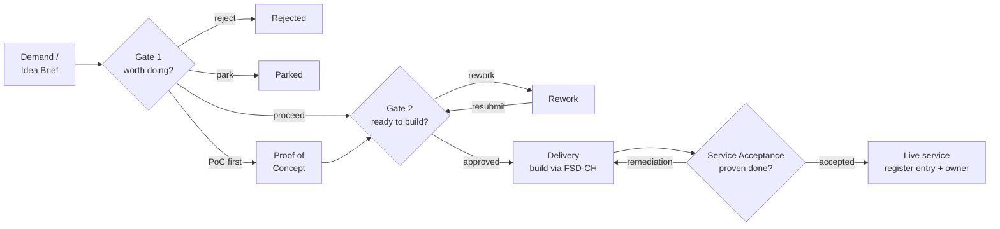
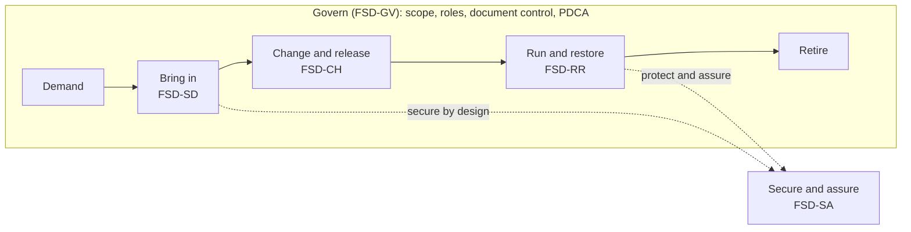
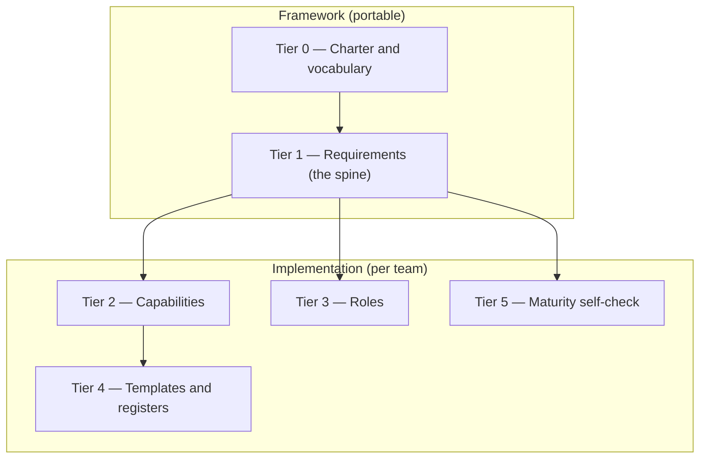
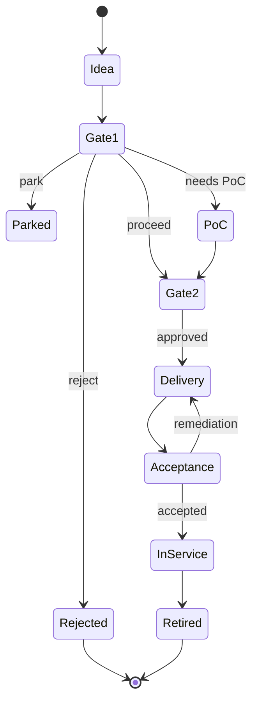
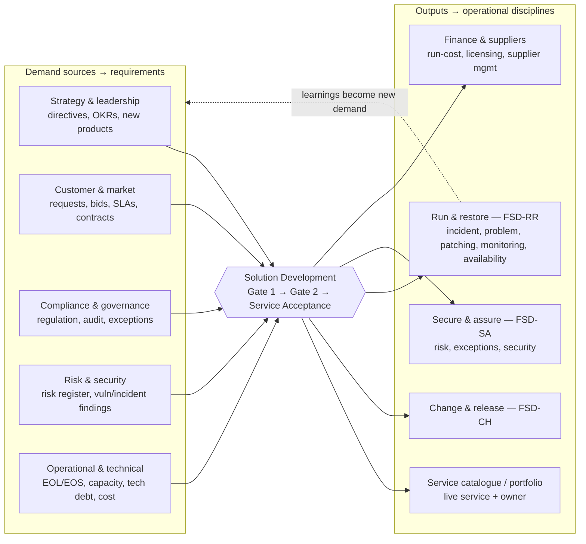

# FitSD — Diagrams

Mermaid source for the framework's process and structure diagrams. These render natively on GitHub/GitLab and in Obsidian, and are embedded in the relevant documents (noted per diagram).

---

## 1. Solution Development — gate flow

*Embedded in `capabilities/solution-development/FSD-PRO` §4. The flagship process: demand in, product out, two decision gates and a service-acceptance close-out.*

---

## 2. Capability model

*Embedded in `FitSD — Framework Charter` §4. Govern wraps everything; Solution Development is the front door; Secure and assure runs across the lifecycle.*

---

## 3. Six-tier document model

*Embedded in `FitSD — Framework Charter` §5. Tiers 0–1 are the portable framework; tiers 2–5 are how a team implements it.*

---

## 4. Service lifecycle (status)

*The state a solution moves through, from idea to retirement. Useful for tracking any one solution's position in the pipeline.*

## 5. Context — inputs and outputs

*Where Solution Development sits between business demand and the operational disciplines. Inputs feed the requirements; outputs feed the run-state capabilities. Note the loop: run-state learnings (e.g. a major incident, a capacity limit) become new demand.*

