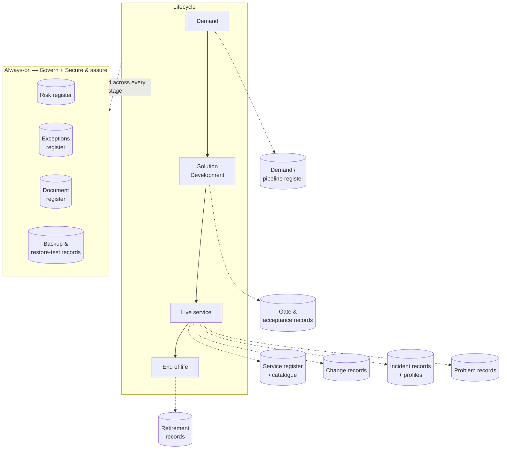

# FitSD — Information Stores

> **What this is.** The registers and records FitSD relies on, gathered in one place and described by *what they hold and who owns them* — never by which tool holds them. FitSD's requirements already call for most of these, scattered across the capabilities; this gathers them so nothing is stored without an owner, and so a team can see its whole information model at a glance. Non-normative: it adds no requirement. (The map is below; it's also catalogued in *FitSD — Diagrams* §6.)

## Why name the stores

A framework that requires records but never lists them invites the quiet failure mode where data accumulates — gate notes here, a risk list there, an access spreadsheet someone started — with no owner, no review, and no one sure which copy is current. Naming the stores is the cheapest way to keep that under control. It mirrors ISO/IEC 27001's *documented information* (clause 7.5) and FitSM's record discipline, and it stays deliberately **tool-agnostic**: a "store" is a register or a record set, whether it lives in a wiki, a work-tracker, a spreadsheet or a database. FitSD says *what must be kept and who keeps it*; you choose where.

## The map

The lifecycle row shows which store each stage creates or updates; the **always-on** group is maintained continuously by Govern and Secure & Assure across every stage.

## The catalogue

| Store | What it holds | Owning capability | Lifecycle stage | Borrowed from |
|---|---|---|---|---|
| **Demand / pipeline register** | Proposed, parked, rejected and in-flight work — with driver, status and reasons | Solution Development → Govern (FSD-GV-4, FSD-SD-1) | Intake → delivery | FitSM PR1 (service portfolio); ITIL service portfolio |
| **Gate records (Gate 1 / Gate 2)** | Per-item decisions, conditions and approver | Solution Development (FSD-SD-6; FRM-01/02) | Gates | ITIL service design records |
| **Service Acceptance records** | Definition-of-Done evidence per service | Solution Development (FSD-SD-4/5; FRM-03) | Acceptance | ITIL service validation & testing |
| **SAC baseline (standing)** | The organisation's ratified Service Acceptance thresholds, inherited by every solution | Govern (FSD-GV-7) | All | ISO 27001 7.5 (documented information) |
| **Service register / catalogue** | Live services, named owner, status (incl. retired) | Govern (FSD-GV-2/4) | Live → retired | FitSM PR1; ITIL service catalogue |
| **Document register / control** | Governing documents with owner, approver, review cycle | Govern (FSD-GV-3) | All | ISO 27001 7.5 (documented information) |
| **Risk register** | Risks, treatment or formal acceptance, owner | Secure & Assure (FSD-SA-1) | All | ISO 27001 clause 6.1; FitSM PR6 |
| **Exceptions register** | Time-bound, compensated departures from policy | Secure & Assure (FSD-SA-4) | All | ISO 27001 (risk acceptance) |
| **Change records** | Changes, risk/authorisation, post-implementation review | Change & Release (FSD-CH-3) | Live | FitSM PR12; ITIL change enablement |
| **Incident records + per-service incident profiles** | Incidents; what counts as an incident *for each service* | Run & Restore (FSD-RR-1/6) | Live | FitSM PR9; ITIL incident |
| **Problem records** | Root-cause investigations | Run & Restore (FSD-RR-3) | Live | FitSM PR10; ITIL problem |
| **Backup & restore-test records** | Backup scope/frequency/retention and dated test restores | Secure & Assure / Run & Restore (FSD-SA-3; SAC) | Acceptance + live | ISO 27001 A.8.13 |
| **RAIDD log** | Risks, assumptions, issues, dependencies, decisions per delivery | Solution Development (FRM-02) | Delivery | Project-management practice |
| **Retirement records** | End-of-life decision (renew / replace / retire) and decommission evidence | Run & Restore (FSD-RR-7) | End of life | ISO 27001 A.8.10 (information deletion); FitSM PR1 (status) |

## The two FitSD adds

Most of the above are implied by existing requirements. Two were missing and are made explicit here:

- **Demand / pipeline register** — gives the *upcoming and in-flight* view that turns a pile of gate records into a portfolio. Without it, "what are we working on?" has no single answer.
- **Retirement records** — the close-out of the lifecycle (FSD-RR-7). Without it, services are never formally retired and the register's history is incomplete.

## See also

- `FitSD — Requirements` — the requirements that mandate these stores (FSD-GV-4 especially)
- `capabilities/govern/FSD-GV — Govern` — Govern owns the information model
- `FitSD — Diagrams` §6 — the picture
- `reference/FitSD — Service Acceptance Criteria` — where the SAC baseline store is defined and ratified
- `reference/FitSD — Standards Alignment` — the FitSM / ITIL / ISO 27001 mappings these borrow from
